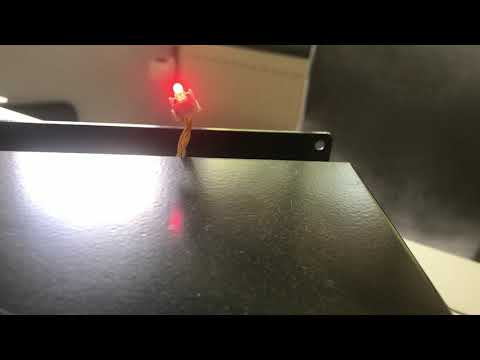
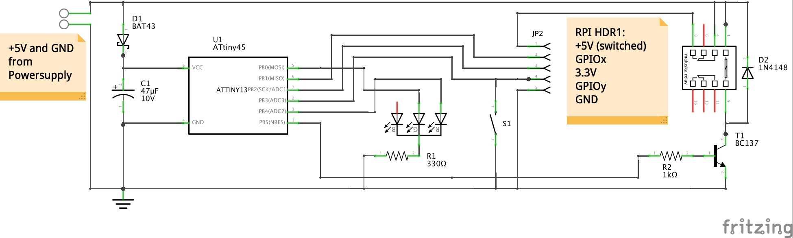
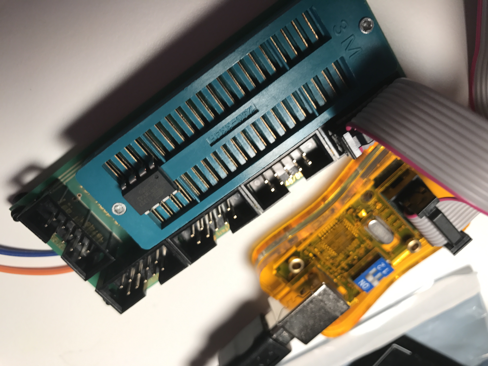

# Powermanagement for RPI

ATtiny45/85 as Powermanagement chip for RPI

functions:

- press push button for 1 second  to switchON relais and rpi will boot 
- press push button for 3 seconds to initiate clean shutdown, after 12 seconds Relais will switchOFF 5V power
- service script 'shutdownbutton', simulates a 3 second button press, if OS command shutdown -h was executed (no push button was pressed)
- status BiColor LED (red/green)  

Video:

video shows switchON, boot, ... , shutdown and switchOFF. (Installed in a prototype device).
 

Schematic:

use .hex file directly to flash ATtiny45/85
avrdude.sh shellscript uses avrdude as flashing utility.

 
If you want to add functionality, you can modify .pas source code and compile it with mikropascal to generate .hex flash file

# Install avrdude

~~~bash
apt update
apt -qy install avrdude
#
cd /usr/local/sbin
wget -N https://raw.githubusercontent.com/rudiratlos/RPI_PowerMgmt/master/RPI_ShutDownReboot.hex
wget -N https://raw.githubusercontent.com/rudiratlos/RPI_PowerMgmt/master/avrdude.sh
chmod +x avrdude.sh
~~~

# Burn ATtiny45/85 with avrdude

connect a stk500V2 compatible AVR programmer on rpi USB port

~~~bash
avrdude.sh
~~~ 

# Install shutdownbutton as a service

~~~bash
apt -qy install raspi-gpio 
#
cd /usr/local/sbin
wget -N https://raw.githubusercontent.com/rudiratlos/RPI_PowerMgmt/master/shutdownbutton
chmod +x shutdownbutton
#
/usr/local/sbin/shutdownbutton install
#
# finally reboot
reboot
~~~
